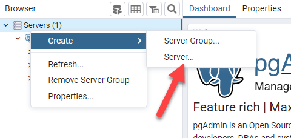
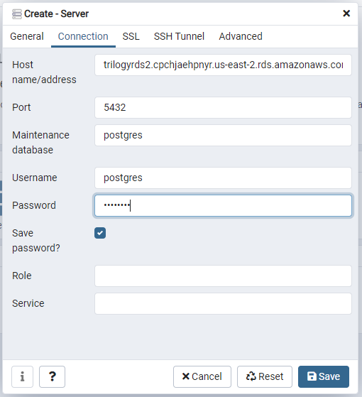
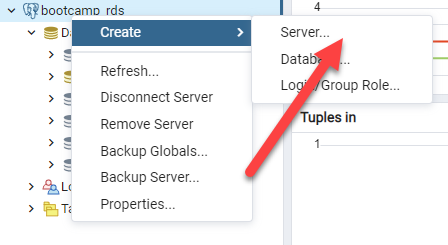

# 7.2 Lesson Plan: Querying Big Data with PySpark

## Lesson Overview

In this class, students will become more familiar with PySpark and the ETL workflow. They will first learn more about how to use PySpark with external databases. Then, they will learn about the grouping and aggregation functions, and how to apply them to a dataset. After learning about `groupBy` and aggregations, they will then learn how to filter and order a DataFrame using PySpark. After that, they will learn how to execute queries in PySpark from RDS and on RDS. Finally, they will put all of these skills together and practice the entire ETL workflow.

## Class Objectives

By the end of class, students will be able to:

- Use PySpark with external databases.
- Apply `groupBy` and aggregation functions to a dataset using PySpark.
- Filter and order a DataFrame using PySpark.
- Bulk insert data into AWS RDS.
- Use PySpark to extract data from S3, join and transform it, and then write the results back to RDS.z

## Class Outline

| | Topic | Time |
| -- | -- | -- |
| 1. | [Accessing S3](#Section1) | 15 Mins |
| 2. | [GroupBy and Aggregations with Transaction Data](#Section2) | 30 Mins |
| 3. | [Ordering and Filtering with PySpark](#Section3) | 55 Mins |
| 4. | [Break](#Section4) | 20 Mins |
| 5. | [Insert Data into RDS](#Section5) | 20 Mins |
| 6. | [Airbnb ETL](#Section6) | 20 Mins |
| 7. | [User Defined Functions (Optional)](#Section7) | 20 Mins |
| 8. | [Review, Recap & End Class](#Section8) | 20 Mins |

> Total Time: 180 Mins


## Instructor Prep
<details>
  <summary><strong>⭐ Getting Started</strong></summary>

* In this lesson, we will primarily focus on further familiarizing students with PySpark. We will cover the entire ETL workflow in this lesson, and students will have an opportunity to develop their own ETL workflow.

* This week's lessons are intended to help students understand the basics of PySpark and to prepare them for next week, where we will cover SparkSQL and Optimization.

* Given that PySpark is a newer concept, some students may struggle with the setup work, along with the ETL workflow. Feel free to spend extra time as needed, where you see fit.

</details>


## Slideshow

The lesson slides for this document are available on Google Drive here: [7.2 Slides](https://docs.google.com/presentation/d/1VTVHlRI5VtpDfhGbcaPyVj-uOtPAhyAHtjaeWd0I1PI/edit). 

---

## Class Activities

### 1. <a name="Section1"></a> Accessing S3

 | Activity Time:       0:15 |  Elapsed Time:      0:00  |
 |---------------------------|---------------------------|

 <details>

   <summary><strong>📣 1.1 Instructor Do: Reading From S3 (0:05)</strong></summary>
<br>

In this section, you will show students how to upload a file to S3, then read from it using PySpark. This is a common operation for those working in the data engineering field. Throughout their careers, students will regularly upload files, transform them, and then save them off somewhere else.

Introduce S3 by explaining the following:

  * **S3:** A service from Amazon Web Services (AWS) that allows us to store files on the cloud.

  * **Bucket:** A separate "folder" where we can store files. Generally buckets help keep files organized.

  * We can access files in S3 through various means, but today we will practice directly pulling files from S3 as part of our PySpark code.

#### Reading From S3 Demonstration

1. Start by opening up Google Colab and walking students through the [running.ipynb](Activities/01-Ins_ReadingFromS3/Solved/running.ipynb) file.

2. Explain to students that we will be reading in the `running.csv` file into PySpark.

Explain to students that they will practice using S3 in the next activity. 

 </details>

 <details>
   <summary><strong>✏️ 1.2 Student Do: Reading From S3 (0:05)</strong></summary>
<br>

In the previous activity, students started to look at how to read a file from S3 in PySpark. In this activity, they will practice this skill. They will read the `avocado.csv` file into PySpark. It is critical to know how to access and import S3 objects as many organizations use S3 to store files.

**Files:**

  * [Activity Instructions](Activities/02-Stu_AvocadoPrices/README.md)

  * [avocado.ipynb](Actvities/02-Stu_AvocadoPrices/Unsolved/avocado.ipynb)

  * [avocado.csv](Activities/02-Stu_AvocadoPrices/Resources/avocado.csv)

    * Data Source: [Avocado Prices](https://www.kaggle.com/neuromusic/avocado-prices)

**Instructions:**

1. Write a PySpark script to read the [avocado.csv](https://2u-data-curriculum-team.s3.amazonaws.com/dataviz-netflix/unit-7/avocado.csv) file in.

 </details>

 <details>
   <summary><strong>⭐ 1.3 Review: Reading From S3 (0:05)</strong></summary>
<br>

Open [avocado.ipynb](Activities/02-Stu_AvocadoPrices/Solved/avocado.ipynb) and walk through the solution line by line, while answering any questions that come up.

Make sure to cover the following points when reviewing this activity:

  * Walk students through reading the `avocado.csv` file into PySpark.

  * Answer any remaining questions.

 </details>

---

### 2. <a name="Section2"></a> groupBy and Aggregations with Transaction Data

 | Activity Time:       0:35 |  Elapsed Time:      0:15  |
 |---------------------------|---------------------------|

<details>
  <summary><strong>📣 2.1 Instructor Do: PCard Transactions (0:15)</strong></summary>
<br>

In the previous set of activities, we walked through how to read a file using PySpark. Now, we will take a closer look at the `groupBy` and aggregation functions. These are important functions for students to know, as they will help students better organize and manipulate their data. The students will likely use `grouBy` and aggregation functions frequently in their roles as data engineers.

Introduce `groupBy` and aggregation functions by explaining the following:

  * Students may have used both the `groupBy` function and aggregation functions before, in other technology stacks.

  * They will use the `groupBy()` function to group different rows together, based on specific columns.

  * There are a number of aggregation functions available. Here are a few:

    * `avg()`

    * `countDistinct()`

    * `count()`

    * `first()`

    * `last()`

    * `max()`

    * `min()`

  * In PySpark, you need to use the `groupBy` function combined with an aggregation function to return your rows. 

  * Explain to students that in the following demonstration, we will analyze a dataset of PCard (Purchase Card) transactions from the state of Oklahoma.

  * Data Source: [PCard Transactions](https://data.world/oklahoma/purchase-card-fiscal-year)

#### groupBy and Aggregation Function Demonstration

1. Open the [PCardTransactions.ipynb](Activities/03-Ins_PCardTransactions/Solved/PCardTransactions.ipynb) file and walk students through the code, explaining each line.

2. Start by importing PySpark.

3. Read the `PCardTransactions.csv` file from the S3 bucket.

    ```python
    # Read in data from S3 Buckets
    from pyspark import SparkFiles
    url = "https://2u-data-curriculum-team.s3.amazonaws.com/dataviz-netflix/unit-7/pcard_transactions.csv"
    spark.sparkContext.addFile(url)
    df = spark.read.csv(SparkFiles.get("pcard_transactions.csv"), sep=",", header=True)

    # Show DataFrame
    df.show()
    ```
    
4. Show students how to perform a `groupby` on the Agency Name column.

    ```python
    df.groupBy('Agency Name')
    ```

5. Explain to students that we will need to use the Amount column, which is currently a string. We need to convert this to a float.

   * We can use the `withColumn()` and the `cast()` methods to convert our Amount column to a float.

   * We will now use the AmountUpdated as our DataFrame to `groupby`. 

    ```python
    amountUpdated = df.withColumn("Amount", df["Amount"].cast('float'))
    ```

6. Show students how to find the maximum amount spent per transaction, by agency name.

    ```python
    amountUpdated.groupBy('Agency Name').max().show()
    ```

7. Show students how to find the sum of all PCard transactions, by agency name.

    ```python
    amountUpdated.groupBy('Agency Name').sum().show()
    ```

8. Explain to students that there are multiple ways that we can aggregate in PySpark.

   * There is no right or wrong way to aggregate.

   * We will use the `agg()` method, with a parameter describing how we should aggregate.

   * Show students how to find the sum of all PCard Transactions, by agency name. 

    ```python
    agency_groups = amountUpdated.groupBy('Agency Name')
    agency_groups.agg({'Amount':'Sum'}).show()
    ```

9. Show students how to find the average amount by agency name using the `agg()` function.

    ```python
    agency_groups.agg({'Amount':'Avg'}).show()
    ```

10. Show students how to find the count of transactions by agency name using the `agg()` function.

    ```python
    agency_groups.agg({'Amount':'count'}).show()
    ```

11. Show students how to find the max transaction per cardholder last name.

   * Remind students that we will need to use the AmountUpdated column for our `groupby` here.

    ```python
    lastname_groups = amountUpdated.groupBy('CardHolder Last Name')
    lastname_groups.agg({'Amount':'Max'}).show()
    ```

12. Show students how to find the average transaction amount per cardholder last name.

    ```python
    lastname_groups.agg({'Amount':'Avg'}).show()
    ```

Share with students that they will practice these skills in the following activity.

</details>

<details>
  <summary><strong>✏️ 2.2 Student Do: Retail Transactions (0:15)</strong></summary>
<br>

In the previous demonstration, students learned more about the `groupBy()` and `agg()` methods. In this activity, students will practice using these methods with the Retail Transactions dataset. Understanding how these methods work will provide students another tool for transforming data into different forms. These are skills that students will use in their careers on a regular basis.

**Files:**

  * [Activity Instructions](Activities/04-Stu_RetailTransactions/README.md)

  * [RetailTransactions.ipynb](Activities/04-Stu_RetailTransactions/Unsolved/RetailTransactions.ipynb)

  * [retail_transactions.csv](Activities/04-Stu_RetailTransactions/Resources/retail_transactions.csv)

    * Data Source: [Retail Transactions](https://www.kaggle.com/regivm/retailtransactiondata?select=Retail_Data_Transactions.csv)

**Instructions:**

1. Read the [retail_transations.csv](https://2u-data-curriculum-team.s3.amazonaws.com/dataviz-netflix/unit-7/retail_transactions.csv) file from S3 into PySpark using Google Colab.

2. Convert the Transaction_Amount column from a string to a float. 

3. Find the average transaction amount by grouping by customer id.

4. Find the maximum transaction amount per customer by grouping by customer id.

5. Find the sum total transaction amount per customer by grouping by customer id.

6. Find the average transaction amount per transaction date.

7. Find the sum total transaction amount per transaction date.

8. Find the maximum transaction amount per transaction date.

</details>

<details>
  <summary><strong>⭐ 2.3 Review: Retail Transactions (0:05)</strong></summary>
<br>

Open the [RetailTransactions.ipynb](Activities/04-Stu_RetailTransactions/Solved/RetailTransactions.ipynb) solution file and walk students through the code.

Be sure to cover the following points:

  * `groupBy()` allows us to group data points by a specific column.

  * `agg()` allows us to group, or aggregate, numeric columns together in different ways such as average or summation of the group.

  * Make sure to answer any remaining questions before moving on.

</details>

---

### 3. <a name="Section3"></a> Ordering and Filtering with PySpark

 | Activity Time:       0:30 |  Elapsed Time:      1:20  |
 |---------------------------|---------------------------|

<details>
  <summary><strong>📣 3.1 Instructor Do: PySpark DataFrame Operations (0:10)</strong></summary>
<br>

In the previous set of activities, we walked through how to use the `groupBy` and aggregation functions. In this set of activities, students will learn how to order and filter a DataFrame using PySpark. This is a fairly common operation in data engineering, because sometimes we don't want to use all of the data in our dataset, or we want the data sorted in a specific way. So this is an important skill for students learn.

Introduce ordering and filtering by explaining the following:

  * Spark can order DataFrames by using the `orderBy()` method.

    * Pass in the column name and either use `asc()` for ascending order or `desc()` for descending order.

  * We can use the `filter()` method to allow us to further manipulate the data, if needed.

#### Ordering and Filtering Demonstration

1. Start by opening the [spark_filtering.ipynb](Activities/05-Ins_Pyspark_DataFrames_Filtering/Solved/spark_filtering.ipynb) in Colab and walking through the file.

    ```python
    # Order a DataFrame by ascending values
    df.orderBy(df["points"].asc()).show(5)

    # Order a DataFrame by descending values
    df.orderBy(df["points"].desc()).show(5)
    ```

2. Spark can also import other helper functions such as `avg()`, which finds the average of the column passed to it.

    ```python
    # Import average function
    from pyspark.sql.functions import avg
    df.select(avg("points")).show()
    ```

3. The `filter()` method allows for more data manipulation, similar to SQL's `WHERE` clause. Here, it filters for all wine with a price less than $20.

    ```python
    # Using filter
    df.filter("price<20").show()
    ```

4. We can choose the exact columns by combining the `select` method with `filter`. 

    ```python
    # Filter by price on certain columns
    df.filter("price<20").select(['points','country', 'winery','price']).show()
    ```

5. Similar to Pandas, Spark can compare multiple conditions using Python operators. 

</details>

<details>
  <summary><strong>✏️ 3.2 Student Do: PySpark Operations (0:15)</strong></summary>
<br>

In this activity, students will use the PySpark filtering functions to filter through the demographic dataset. Filtering and ordering DataFrames is an essential operation in PySpark. Data engineers often want to filter out some of the data within a dataset, or to order the data so they can view the most or least important rows first. So this is good practice for students.

**Files:**

  * [demographics_filtered.ipynb](Activities/06-Stu_Pyspark_DataFrames_Filtering/Unsolved/demographics_filtered.ipynb)

  * [demographics.csv](Activities/06-Stu_Pyspark_DataFrames_Filtering/Resources/demographics.csv)

  * [Activity Instructions](Activities/06-Stu_Pyspark_DataFrames_Filtering/README.md)

**Instructions:**

Using PySpark methods and the [demographics.csv](https://2u-data-curriculum-team.s3.amazonaws.com/dataviz-netflix/unit-7/demographics.csv) dataset, answer the following questions:

1. Which occupation has the highest salary?

2. Which occupation has the lowest salary?

3. What is the mean salary of this dataset?

4. What are the maximum and minimum values of the Salary column?

5. List all of the occupations that have salaries above $80,000.

6. **Bonus:** What is the average age and height for each academic degree type?

   * *Hint:* You will need to use `groupBy` to answer this question.

</details>

<details>
  <summary><strong>⭐ 3.3 Review: PySpark Operations (0:05)</strong></summary>
<br>

Open the [demographics_filtered.ipynb](Activities/06-Stu_Pyspark_DataFrames_Filtering/Solved/demographics_filtered.ipynb) file in Colab, and review the code with the class.

Make sure to cover the following points:

  * Use the `orderBy` method with `desc` to show the occupations and salaries in descending order.

  * We can leave out `desc` to get the values in ascending order.

  * We can import functions such as `mean` and apply them to our columns. This creates an aggregate view called `avg(Salary)`.

  * We can apply `min` and `max` functions to the Salary column.

  * We can use a filter to show all occupations with salaries greater than $80,000.

  * We can use `groupBy` with an aggregation function to show the average age and height by academic degree type.

</details>

---

### 4. <a name="Section4"></a> Break

 | Activity Time:       0:10 |  Elapsed Time:      1:30  |
 |---------------------------|---------------------------|

---


## 5. <a name="Section5"></a> Insert Data into RDS


 | Activity Time:       0:35 |  Elapsed Time:      2:05  |
 |---------------------------|---------------------------|

<details>
  <summary><strong>📣 5.1 Instructor Do: RDS Deep Dive (0:20)</strong></summary>
<br>

Now, students understand how to use filtering and ordering in PySpark. In this next section, we will explore AWS RDS, and how to interact with it using PySpark. This is an important skill for students to have, as they may work with many different cloud services throughout their careers. In this section, we want to help students understand the rhythm of these workflows.

Introduce this section by explaining the following:  

  * Students will learn about an **extract, transform, and load (ETL)** workflow in this section.

  * We will read a file from S3 into PySpark, create a new database table, then insert the data into that database table.

  * RDS is a database hosting services offered through AWS. You can create a bunch of different kinds of databases here. We will be using a Postgres database.

  * Specifically for this class, we will all connect to the same Postgres RDS instance. However each student will be responsible for making their own database in the RDS instance and uploading data within their own database.

  * Caution students that when it comes to a cloud database, they need to be mindful of the changes they are making. Students should double check that they are using the correct database and ensure their queries are correct before executing any commands.

    * Before we demonstrate reading and writing from an RDS instance, we will walk students through connecting to the classroom RDS instance.

  * We will be appending the data to a table that we create within our personal database.

    * *Note:* There will be nothing in the table when we create it, so we will just add data to the table. If there was already data in the table, we would just add to that.

  * Data Source: [NYC Restaurant Week](https://www.kaggle.com/popoandrew/restaurant-week-2018)

#### Reading and Writing From AWS RDS Demonstration

1. Start by having everyone load their pgAdmin interface and login using their credentials.

2. Right click the `Servers` tab from the left navigation pane and select `Create` > `Server`.



3. On the `General` tab, have each student name the server connection `bootcamp_rds` or something similar. Then move to the `Connection` tab.

4. Share with the students the connection credentials of the RDS server:
  * Hostname: `trilogyrds2.cpchjaehpnyr.us-east-2.rds.amazonaws.com`
  * Port: 5432
  * Username: `postgres`
  * Password: `postgres`



5. Click `Save`, then expand the `bootcamp_rds` database in the navigation pane to see all of the databases within the RDS instance.

6. Everyone should create their own database within the RDS instance to use for the remainder of the course. Right click the `bootcamp_rds` database and select `Create` > `Database`.



7. Students can name their database however they like such as `practice_xx` where `xx` are the initials for each student. Once they name their database press `Save`.

  * Because everyoe is using the same RDS instance, it is critical that each student makes a unique database so they do not overwrite eachother's work. Using their initials as a suffix allows for a unique database name for each student.

  * Once students have their own database, they can use the Query Tool for their respective databases and continue with the rest of the demonstration.

1. Open the [RestaurantWeek.ipynb](Activities/07-Ins_RestaurantWeek/Solved/RestaurantWeek.ipynb) file and walk students through the code.

2. Read the [restaurant_week.csv](Activities/07-Ins_RestaurantWeek/Resources/restaurant_week.csv) file into Pyspark.

    ```python
    from pyspark import SparkFiles
    url = "https://2u-data-curriculum-team.s3.amazonaws.com/dataviz-netflix/unit-7/restaurant_week.csv"
    spark.sparkContext.addFile(url)
    df = spark.read.csv(SparkFiles.get("restaurant_week.csv"), sep=",", header=True)
    ```

3. Start by creating a new table in the RDS Postgres database called `restaurantweek`.

```sql
CREATE TABLE restaurantweek (
  name VARCHAR NOT NULL,
  street_address VARCHAR,
  google_map VARCHAR,
  review_count INT,
  phone VARCHAR,
  website VARCHAR,
  restaurant_type VARCHAR,
  average_review VARCHAR,
  food_review VARCHAR,
  service_review VARCHAR,
  ambience_review VARCHAR,
  value_review VARCHAR,
  price_range VARCHAR,
  star_1 VARCHAR,
  star_2 VARCHAR,
  star_3 VARCHAR,
  star_4 VARCHAR,
  star_5 VARCHAR,
  description VARCHAR,
  restaurant_main_type VARCHAR,
  latitude VARCHAR,
  longitude VARCHAR,
  postal_code VARCHAR
);
```

4. Next, we will need to bulk insert the `restaurant_week.csv` file into the RDS database. Let's first establish the Postgres URL to use.

  * Mention to students that the `<Database Name>` parameter should typically be filled in with `postgres`, if you are using a postgres database.

    ```python
    postgres_url="jdbc:postgresql://<Database URL>:5432/<Database Name>"
    config = {"user":"postgres",
              "password": "<PASSWORD>",
              "driver":"org.postgresql.Driver"}
    ```

5. There are a few ways to insert a DataFrame into a database. You can either append to the existing data in the table, or overwrite the data in the table. For today, we'll just look at appending the data.

    ```python
    df.write.jdbc(postgres_url,table="restaurantweek",mode="append", properties=config)
    ```

Explain to students that they will have an opportunity to practice interacting with with RDS and S3 in the next activity.

</details>

<details>
  <summary><strong>✏️ 5.2 Student Do: Michelin Star Dining with RDS (0:15)</strong></summary>
<br>

In the previous demonstration, students learned how to connect to an RDS database and insert records into a table. In this activity, students will have a chance to practice this skill. As data engineers, the students will be expected to know how to work with S3 and PySpark, as these are common tools. They will also be expected to know how to connect to an RDS database from PySpark.

**Files:**

  * [Activity Instructions](Activities/08-Stu_MichelinStarDining/README.md)

  * [MichelinDining.ipynb](Activities/08-Stu_MichelinStarDining/Unsolved/MichelinDining.ipynb)

  * [michelin_star_dining.csv](Activities/08-Stu_MichelinStarDining/Resources/michelin_star_dining.csv)

    * Data Source: [Michelin Restaurants](https://www.kaggle.com/jackywang529/michelin-restaurants)

**Instructions:**

1. Read the [michelin_star_dining.csv](https://2u-data-curriculum-team.s3.amazonaws.com/dataviz-netflix/unit-7/michelin_star_dining.csv) file into PySpark.

2. Create a new table in the RDS Postgres database called `michelin_star_dining`.

3. Bulk insert the DataFrame into the `michelin_start_dining` table.

</details>

<details>
  <summary><strong>⭐ 5.3 Review: Michelin Star Dining with RDS (0:05)</strong></summary>
<br>

Open the [MichelinDining.ipynb](Activities/08-Stu_MichelinStarDining/Solved/MichelinDining.ipynb) solution file and walk students through the code line by line.

Make sure to cover the following points:

  * Students will need to use the JDBC connector to connect to the Postgres database. 

    * **JDBC**: Also known as Java Database Connectivity, JDBC is a Java API that allows us to connect to different kinds of relational databases.

  * Explain the configuration file and that the parameters are passed in to the JDBC method.

  * Answer any remaining questions that come up.

</details>

---

### 6. <a name="Section7"></a> Airbnb ETL

 | Activity Time:       0:45 |  Elapsed Time:      2:50  |
 |---------------------------|---------------------------|

<details>
  <summary><strong>📣 6.1 Instructor Do: Madrid Airbnb ETL (0:15)</strong></summary>
<br>

In the previous section, students learned more about RDS and PySpark, and how they can fit together. In this next section, students will put all of the skills they have learned in this lesson into practice.

Introduce this demonstration by explaining the following:

  * This demonstration will follow a similar workflow to the previous activity.

    * We will be practicing an ETL workflow. Students will see how to read a file from S3 into PySpark, create a new database table in Postgres, transform the data, then bulk insert the data in the database table.

  * This will be great practice putting together all of the concepts that we have covered in today's lesson.

  * We will use the `Madrid Airbnb Listings` dataset to accomplish this task.

    * Data Source: [Madrid Airbnb Listings](https://www.kaggle.com/rusiano/madrid-airbnb-data?select=listings.csv)

#### Airbnb ETL Demonstration

1. Start by opening the [MadridListings.ipynb](Activities/09-Ins_MadridAirbnbETL/Solved/MadridListings.ipynb) solution file and walking students through the code.

2. Create a new RDS Postgres database table called `madridlistings`.

    ```sql
    CREATE TABLE madridlistings (
      id VARCHAR NOT NULL,
      name VARCHAR,
      host_id VARCHAR,
      host_name VARCHAR,
      neighbourhood_group VARCHAR,
      neighbourhood VARCHAR,
      latitude VARCHAR,
      longitude VARCHAR,
      room_type VARCHAR,
      price VARCHAR,
      minimum_nights VARCHAR,
      number_of_reviews VARCHAR,
      last_review VARCHAR,
      reviews_per_month VARCHAR,
      calculated_host_listings_count VARCHAR,
      availability_365 VARCHAR
    );
    ```

3. Next, we need to read the `listings.csv` file into our Google Colab PySpark instance.

    ```python
    # Read in data from S3 Buckets
    from pyspark import SparkFiles
    url = "https://2u-data-curriculum-team.s3.amazonaws.com/dataviz-netflix/unit-7/listings.csv"
    spark.sparkContext.addFile(url)
    df = spark.read.csv(SparkFiles.get("listings.csv"), sep=",", header=True)

    # Show DataFrame
    df.show()
    ```

4. After reading the `listings.csv` file into PySpark, we'll need to convert a few of the numeric columns to floats.

    ```python
    df = df.withColumn("price", df["price"].cast('float'))
    df = df.withColumn("calculated_host_listings_count", df["calculated_host_listings_count"].cast('float'))
    df = df.withColumn("availability_365", df["availability_365"].cast('float'))
    ```

5. Show students how to find the average price for each neighborhood.

    ```python
    priceGrouped = df.groupBy('neighbourhood_group')
    priceGrouped.agg({'price':'Avg'}).show()
    ```

6. After showing students how to find the average price for each neighborhood, show them how to find the average availability for each room type.

    ```python
    roomTypeGrouped = df.groupBy('room_type')
    roomTypeAgg = roomTypeGrouped.agg({'availability_365':'Avg'})
    ```

7. Explain to students that we will now sort this DataFrame in descending order.

    ```python
    roomTypeAgg.orderBy(roomTypeAgg['avg(availability_365)'].desc()).show()
    ```

8. Show students how to find the listings where the price is greater than 75.

    ```python
    greaterthan_75 = df.filter("price>75")
    ```

9. Show students how to order the DataFrame in descending order.

    ```python
    output = greaterthan_75.orderBy(greaterthan_75['price'].desc())
    output.show()
    ```

10. Finally, we will save our `madridlistings` table.

    ```python
    postgres_url="jdbc:postgresql://<Database URL>:5432/<Database Name>"
    config = {"user":"postgres",
              "password": "<PASSWORD>",
              "driver":"org.postgresql.Driver"}
    output.write.jdbc(postgres_url,table="madridlistings",mode="append", properties=config)
    ```

Explain to students that they will have an opportunity to practice this workflow in the next example.

</details>

<details>

  <summary><strong>✏️ 6.2 Student Do: Zillow Housing Prices ETL (0:20)</strong></summary>
<br>

In the previous demonstration, students gained further experience with ETL workflows. In this activity, students will practice their ETL workflow skills with the Zillow Housing Prices dataset. In this lesson, students have learned about a lot of different tools and how they interact. This is a great opportunity to practice putting it all together. Students will often need to interact with these different tools in their future jobs.

**Files:**

  * [Activity Instructions](Activities/10-Stu_ZillowHousingPricesETL/README.md)

  * [ZillowHousingPrices.ipynb](Activities/10-Stu_ZillowHousingPricesETL/Unsolved/ZillowHousingPrices.ipynb)

  * [zillow_housing_prices.csv](Activities/10-Stu_ZillowHousingPricesETL/Resources/zillow_housing_prices.csv)

    * Data Source: [Zillow Housing Prices](https://www.kaggle.com/paultimothymooney/zillow-house-price-data?select=Sale_Prices_City.csv)

**Instructions:**

1. Read the [zillow_housing_prices.csv](https://2u-data-curriculum-team.s3.amazonaws.com/dataviz-netflix/unit-7/zillow_housing_prices.csv) file into a PySpark DataFrame.

2. Create a new table called `zillowhousingprices` in the RDS Postgres database.

3. Modify the `2020-01`, `2020-02`, and `2020-03` columns to be floats.

4. Display the average price per state for the month of `2020-01`.

5. Sort this DataFrame in descending order.

6. Bulk insert the 2020 prices into the `zillowhousingprices` table.

</details>

<details>

  <summary><strong>⭐ 6.3 Review: Zillow Housing Prices ETL (0:05)</strong></summary>
<br>

Open the [ZillowHousingPrices.ipynb](Activities/10-Stu_ZillowHousingPricesETL/Solved/ZillowHousingPrices.ipynb) solution file and walk students through the code.

Cover the following during your review:

  * The students' code may look slightly different from the solution code, as there are multiple ways to accomplish the instructions above.

  * Make sure to walk through the database setup if students are having trouble with that part.

  * This is a common ETL workflow. There are many other types of ETL workflows, but we've focused on this one to help students become familiar with these tools.

  * Answer any remaining questions before wrapping up the class.

</details>

---

## 7. <a name="Section1"></a> User Defined Functions (Optional)

 | Activity Time:       0:35 |  Elapsed Time:      0:35  |
 |---------------------------|---------------------------|

 <details>
   <summary><strong>📣 7.1 Instructor Do: User Defined Functions (15 Mins)</strong></summary>

Please note that these are optional activities if there is enough time at the end of class. In this demonstration, instructors will show students how to create a new UDF and reference it in their code. This is a common operation for those working in the Data Engineering field, as engineers will often want to replicate common functionality and need a way to do that in PySpark.

Introduce the activity by explaining the following:

  * **User Defined Function:** A common function or framework that you plan to use more than once in your code.

  * User Defined Functions, or UDF's, are very common in PySpark. They are very similar to UDF's in database management systems, and somewhat similar to functions in Python.

  * Students can think of UDF's as a way to replicate common functionality to be able to reuse as necessary.

  * UDF's should be used sparingly, as they are considered to be an "expensive" operation.

    * They are considered to be "expensive" as PySpark treats them as a black box and cannot perform any sort of optimization.

    * The general rule is to first use the built-in SparkSQL functions, then if these don't fit what you need, then create a UDF.

  * Explain that we will be creating a UDF to covert temperatures from Celsius to Fahrenheit.

#### User Defined Functions Demonstration

1. Start by opening the [RainfallTemperature.ipynb](Activities/11-Ins_RainfallTemperature/Solved/RainfallTemperature.ipynb) Jupyter Notebook and walk students through the solution.

2. Explain to students that we will need to read in the [rainfall_temperature.csv](https://2u-data-curriculum-team.s3.amazonaws.com/dataviz-netflix/unit-7/rainfall_temperature.csv) file from S3 to PySpark.

  * Data Source: [Average Rainfall Temperature](https://data.world/datagov-uk/cb5b2810-2d41-47c0-9ca8-3514808675ac)

3. Show students how to create a new user defined function called `celsius_to_fahrenheit()`.

  * Explain to students that we will be using the common calculation for converting Celsius to Fahrenheit in this function.

  * Explain that since we don't know what the datatype will be of the temperature, we can convert that to a float here.

```python
def celsius_to_fahrenheit(temperature):
  temperature = float(temperature)
  temperature = (temperature * 1.8) + 32
  return temperature
```

4. After creating a new function called `celsius_to_fahrenheit()`, we need to register this function in PySpark. We can do that by using the following line.

```python
spark.udf.register("celsius_to_fahrenheit", celsius_to_fahrenheit)
```

5. Explain to students that once we have registered the function, we need to create a new temporary view called `rainfall_temperature`.

```python
df.createOrReplaceTempView("rainfall_temperature")
```

6. After creating the `rainfall_temperature` temporary view, we can query it using Spark SQL. We can also call our User Defined Function `celsius_to_fahrenheit` as part of the select statement. This will return the `PublishedDate` and the temperature in Fahrenheit.

```python
temp_df = spark.sql("SELECT PublishedDate, celsius_to_fahrenheit(Temp) FROM rainfall_temperature")
temp_df.show()
```

Explain to students that they will have an opportunity to practice using writing their own UDF's in the next activity.

 </details>

 <details>
   <summary><strong>✏️ 7.2 Student Do: User Defined Functions (15 Mins)</strong></summary>

In the previous activity, students learned how to use User Defined Functions or UDF's. In this activity, they will have an opportunity to practice creating a UDF and implementing it in PySpark. As a Data Engineer, this is a common functionality that students will use. This will help students write more complex code and functionality.

**Files:**

  * [Activity Instructions](Activities/12-Stu_AdvertisingSpend/README.md)

  * [AdvertisingSpend.ipynb](Activities/12-Stu_AdvertisingSpend/Unsolved/AdvertisingSpend.ipynb)

  * [AdvertisingSpend.csv](Activities/12-Stu_AdvertisingSpend/Resources/AdvertisingSpend.csv)

    * Data Source: [Advertising Spend](https://data.world/makeovermonday/2020w46)

**Instructions:**

1. Read the [AdvertisingSpend.csv](https://2u-data-curriculum-team.s3.amazonaws.com/dataviz-netflix/unit-7/AdvertisingSpend.csv) file into PySpark.

2. Create a new User Defined Function that divides the advertising spend dollars into millions of dollars.

3. Use this new User Defined Function to return the source and the dollars amounts as millions of dollars for the years 2020 through 2024.

 </details>

 <details>
   <summary><strong>⭐ 7.3 Review: User Defined Functions (5 Mins)</strong></summary>

Open [AdvertisingSpend.ipynb](Activities/12-Stu_AdvertisingSpend/Unsolved/AdvertisingSpend.ipynb) and walk through the solution line by line, while answering any questions that come up.

Make sure to cover the following points when reviewing this activity:

  * Students should have to replace a number of characters to clean up the dataset in order to convert the string to a float.

  * Students will have had to use back ticks in the column names. In SQL, you are required to use back ticks in column names which are integers.

    * Students should have noticed that if you do not put back ticks, then SQL will just interpret those numbers as numbers, and not as a column name.

  * Explain the User Defined Function and how we are calculating dollars to millions of dollars.

  * Answer any remaining questions that come up.

 </details>

---

## 8. <a name="Section8"></a> Review, Recap & End Class

 | Activity Time:       0:10 |  Elapsed Time:      3:00  |
 |---------------------------|---------------------------|

<details>
  <summary><strong>📣 8.1 Instructor Do: Answer Questions (0:10)</strong></summary>
<br>

As a reminder, our class objectives for today were to:

  * Use PySpark with external databases.

  * Apply `groupBy` and aggregation functions to a dataset using PySpark.

  * Filter and order a DataFrame using PySpark.

  * Bulk insert data into AWS RDS.

  * Using PySpark, extract data from S3, transform it, then write the results back to RDS.


Make sure to answer any lingering questions students may have.
</details>

---

© 2021 Trilogy Education Services, a 2U, Inc. brand. All Rights Reserved.
